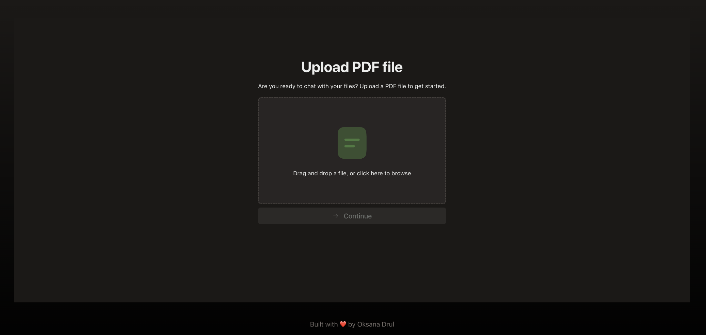
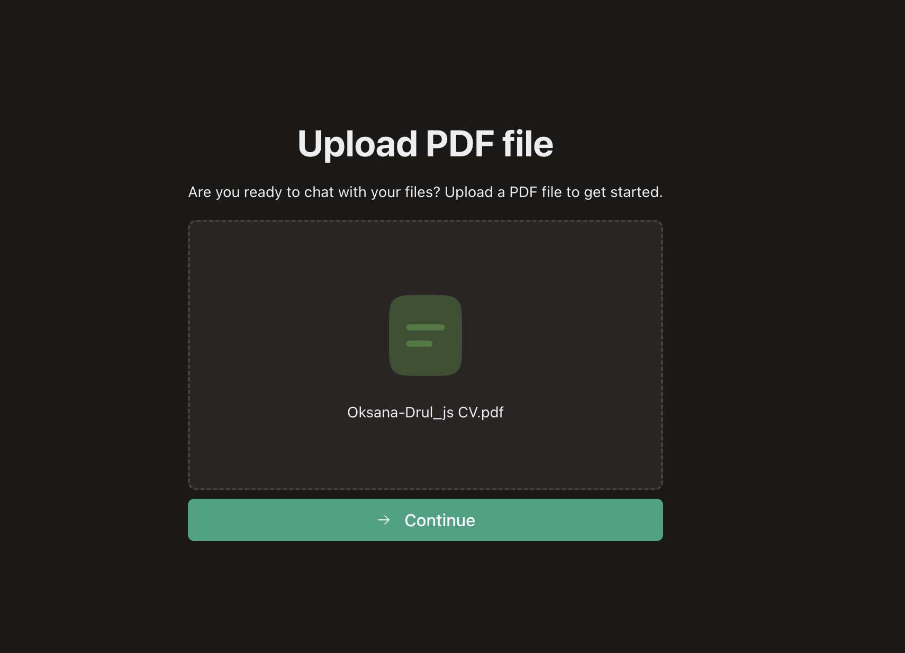
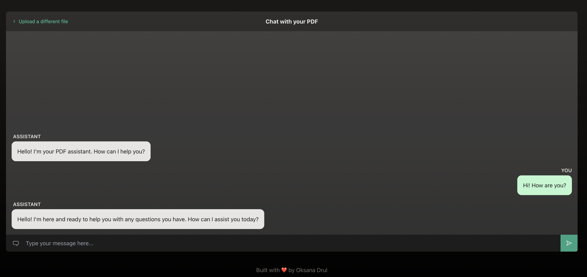
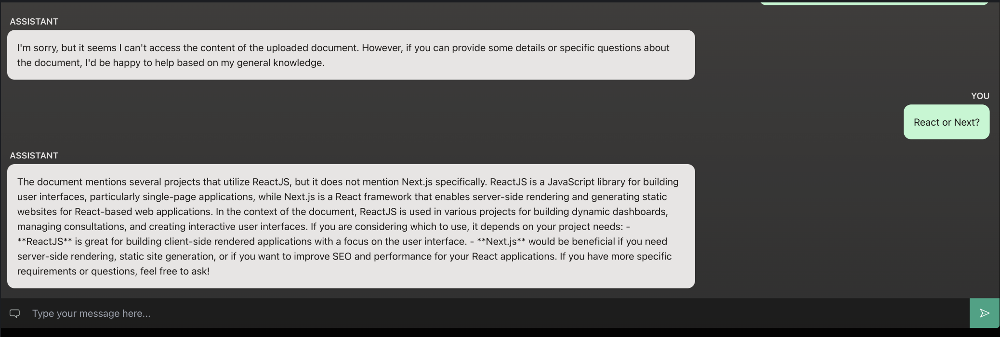

# 🤖 AI PDF Chatbot

Ever wanted to chat with your PDF documents? Now you can. Upload a PDF (for example your CV) and ask questions — the assistant uses the document content to answer.

<p align="center">
  
</p>

## Technologies

- **Framework:** [Next.js 13](https://nextjs.org/) (App Router)
- **Language:** TypeScript
- **UI:** React 18, [Radix UI Themes](https://www.radix-ui.com/themes), [Tailwind CSS](https://tailwindcss.com/)
- **AI:** [Vercel AI SDK](https://sdk.vercel.ai/) (`ai`), [OpenAI](https://openai.com/) (GPT-4o)
- **PDF & RAG:** [pdf-parse-fixed](https://www.npmjs.com/package/@cyber2024/pdf-parse-fixed) for text extraction, [LlamaIndex](https://www.llamaindex.ai/) for vector index and retrieval
- **File upload:** [react-drag-drop-files](https://www.npmjs.com/package/react-drag-drop-files)

## How to start

### Prerequisites

- Node.js 18+
- npm or yarn

### Setup

1. **Clone and install**

   ```bash
   git clone https://github.com/oksanadrul/ai-pdf-chat.git
   cd ai-pdf-chat
   npm install
   ```

2. **Environment**

   Create a `.env` file in the project root with your OpenAI API key:

   ```env
   OPENAI_API_KEY=your_openai_api_key_here
   ```

3. **Run the app**

   ```bash
   npm run dev
   ```

   Open [http://localhost:3000](http://localhost:3000). You’ll be redirected to the upload page.

### Other scripts

- `npm run build` — production build
- `npm run start` — run production server (after `npm run build`)
- `npm run lint` — run ESLint

## How to use

1. **Upload a PDF**  
   On the first screen, drag and drop a PDF or click to browse. Choose your file and click **Continue**. The app extracts text, builds a vector index, and stores it under `./storage`.

2. **Chat with your document**  
   After upload you’re taken to the chat view. Type questions in the input and send. The assistant uses the indexed PDF content (when relevant) to answer. You can ask about your CV, a report, or any uploaded document.

3. **Switch document**  
   Use **&lt; Upload a different file** at the top to go back to the upload page and choose another PDF.

---

## Screenshots: Chat after uploading a CV


| Step | Description | Image |
|------|-------------|-------|
| 1. Upload | Upload PDF screen: drag & drop or browse, then Continue. |  |
| 2. Chat | Chat with your PDF: assistant greeting and message input. |   |
| 3. Example | Example: e.g. “React or Next?” — answer grounded in the document (e.g. CV skills). |   |


---


Built with ❤️ by Oksana Drul
